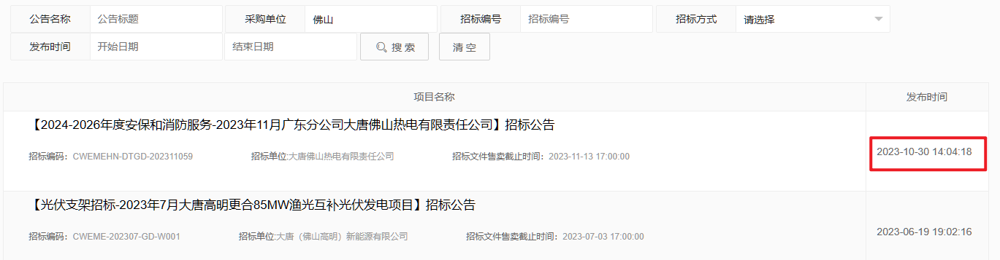

# 爬虫爬取大唐中国招标信息

> 收到一个任务，要我爬一下指定关键字单位的大唐中国的招标信息，每天挂着程序，如果有新的就发邮件通知。网址是[大唐集团电子商务平台 (cdt-ec.com)](https://tang.cdt-ec.com/notice/webpage/jsp/more.jsp)，但是要通过[大唐电子商务平台 (cdt-ec.com)](https://tang.cdt-ec.com/home/)点击更多进去才会有信息。

* 使用前要手动替换程序中的邮箱，已删除
* py文件名就是关键字，这样可以让发送过去就是一个exe文件

### 方式

看了一下，是有风控的，难点在于找到cookie中的`acw_sc__v2` 字段，通过网上检索可以知道，这个字段可以通过js逆向进行解决，我主要参考了[Nike登录的acw_sc__v2参数逆向详细思路分析（非常简单，建议入手）含AST解混淆代码_acw sc v2-CSDN博客](https://blog.csdn.net/qq_41866988/article/details/131263718)。遇到解析失败就重启请求cookie，然后保存下来，因为请求这个过多会封ip，其他也没有啥难的地方了。

### 包含

- [x] `python`调用`js`

- [x] 爬虫

- [x] 自动发邮件

- [x] 定时任务

